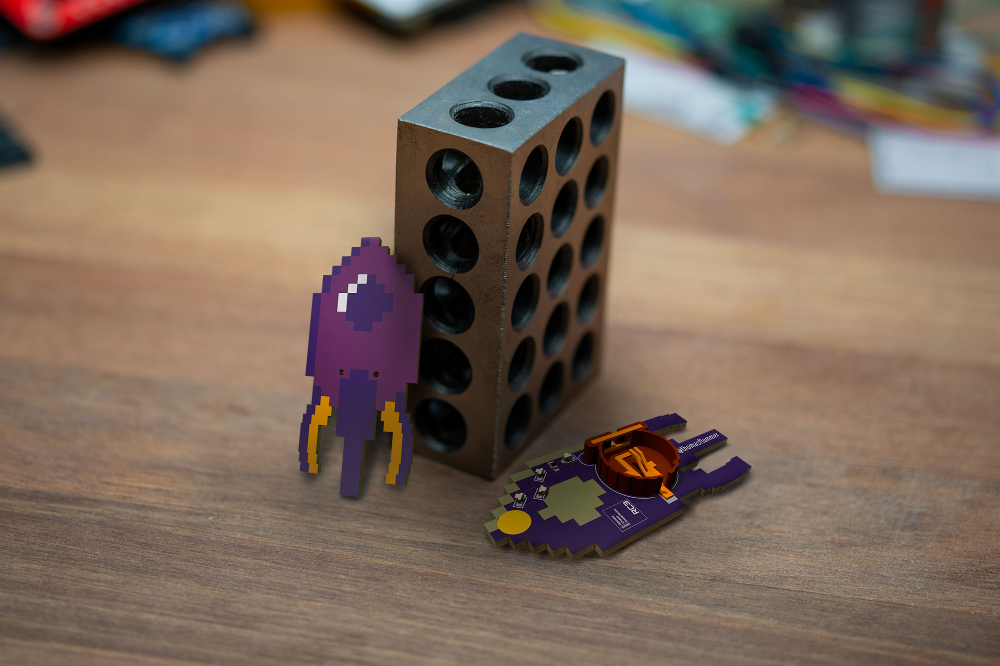

# Fairy Dust mini PCB pin for RC3

This is a small PCB pin badge, heavily inspired by the [RC3 styleguide](https://styleguide.rc3.world/RC3%20Style%20Guide%20Essentials.pdf). It's designed to be small, easy to assemble and hopefully many will manage to get some before the event, and be able to share a little bit of physical #badgelife, in this time of virtual events.

## Making your own

If you want to make your own, I have included the gerbers, in case you don't want to install the nightly version of KiCad.

There is also a [shared projects at OSHPark](https://oshpark.com/shared_projects/DYZInoHY), and this is designed for the standard purple PCBs. It's designed to be exactly 2 square inches, so for USD 10 you get 3 pcs. shipped anywhere, though the standard shipping might take a bit to arrive.

The parts needed for this pin is simply 4 white 0603 LEDs, a series resistor, also 0603, to limit the current a bit (I'll try with a 1K to begin with), a CR1220 coin cell holder (I'm planning on using a [Q&J CR1220-2 from LCSC](https://lcsc.com/product-detail/Battery-Holders-Clips-Contacts_Q-J-CR1220-2_C70381.html)) and then a little round brooch clasp/tie tack pin (I got some on ebay, but a DIY/craft supply store might also have them).

## Please share

If you decide to make this badge or a variant of it, please share images so we can all see it and get inspired. If sharing on social media, please use the #badgelife tag and please let [me](https://thomasflummer.com/) know, I would love to see what you have made!
